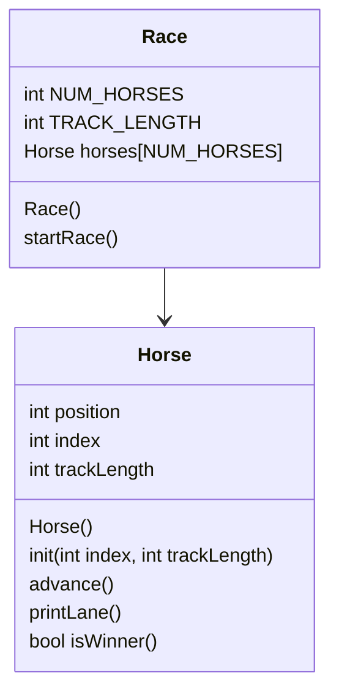

# Horse Race / Objects

```mermaid
classDiagram

class Horse{
    int position
    int index
    int trackLength

    Horse()
    init(int index, int trackLength)
    advance()
    printLane()
    bool isWinner()

}

class Race{
    int NUM_HORSES
    int TRACK_LENGTH
    Horse horses[NUM_HORSES]

    Race()
    startRace()
}

Race --> Horse
```
