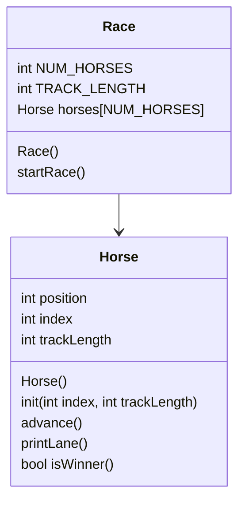

# Horse Race / Objects


# Horse
### Horses::Horse()
```
set position to 0
set index to 0
set trackLength to 15
```
### Horses::init(int index, int trackLength)
```
set position at 0
set Horse:: index to to index
set Horse:: trackLength to track length
```
### Horse::advance()
```
using srand random value 0 to 1
add to horse position
```
### Horse::printLane()
```
for horseNum in array
  if horse's integer value matches position
    print horseNum
  else
    print a dot
```
### Horse::bool isWinner()
```
bool result = false
if horse's position == trackLength
  print "This horse won!"
  result = true
return result
```
# Race
### Race::Race()
```
const static int NUM_HORSES = 5
const int TRACK_LENGTH

seed random generator
initialize the horses array
for each horse in the array
  initialize the horse's index and trackLength
```
### void Race::startRace()
```
bool keepGoing = true
while keepGoing
  for each horse in the array
    advance horse
    print that horse's lane
    and if a horse returns true from isWinner()
      keepGoing = false
```


